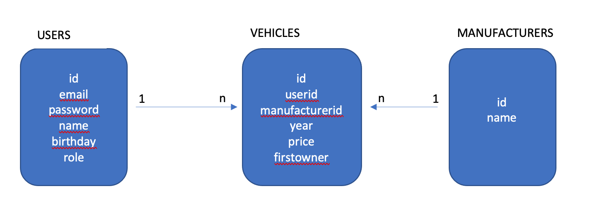

# fastify - fastify-cli - swagger - sequelize - postgres - jwt - fluent json schema - standardjs

### TL;DR;
Is not always easy to learn new things from scratch. 

This project is an attempt to summarize several concepts I´ve learned about these tools and perhaps helps someone in the beggining path.

It has some CRUD examples wich envolves several concepts.

---

## Introduction

This project can be used as a scaffold, it envolves several concepts like jwt login, CRUD using sequelize and postgres, api documentation, javascript linting and so on.

Used technologies and tools:

- [fastify](https://www.fastify.io/)
- [fastify-cli](https://github.com/fastify/fastify-cli)
- [fastify-fluent-json-schema](https://github.com/fastify/fluent-json-schema)
- [fastify-jwt](https://github.com/fastify/fastify-jwt)
- [fastify-swagger](https://github.com/fastify/fastify-swagger)
- [postgres](https://www.postgresql.org/)
- [sequelize](https://sequelize.org/master)
- [StandardJS](https://marketplace.visualstudio.com/items?itemName=standard.vscode-standard)

--- 
## Database:

Even I'm using sequelize I'll not create database schema using the sequelize migrate tool (code first aproach). I personnaly think it is not a very realistic situation where someone starts a project with no legacy database. At some point changes will occur in backend framework, but database will remain the same. That's just my opinion about this subject.

Database schema: it has a three tables with some fields and relations:

---
## Requirements

- Node LTS
- docker
- docker-compose

## Setup

- `npm i`
- `npm run db:up`
- `npm run db:migrate`
- create a new file called `.env` and paste contents from `.env.example` (or simply rename `env.example` to `.env`)

## Running

- `npm run dev`
- Swagger will be listening at http://localhost:3000/swagger

---
## Routes explanation

### Users routes:
 - POST `/users/login` => get a valid token
 - GET `/users/login` => verify if token is valid (authorization header with Bearer token)
 - POST `/users` => add a user
 - PUT `/users/{:id}` => edit a user (user can edit himself)
 - DELETE `/users/{:id}` => delete a user (user can delete himself, unless he is an administrator)
 - GET `/users` => get a list of users. Can filter by name, email or bith month

 ### Manufacturer routes:
 - POST `/manufacturers` => add a manufacturer (only administrators can add)
 - PUT `/manufacturers/{:id}` => edit a manufacturer (only administrators can add)
 - DELETE `/manufacturers/{:id}` => delete a manufacturer (only administrators can add)
 - GET `/manufacturers` => get a list of manufacturers. Can filter by name

 ### Vehicles routes:
 - POST `/vehicles` => add a vehicle
 - PUT `/vehicles/{:id}` => edit a vehicle (user can edit his own vehicles)
 - DELETE `/vehicles/{:id}` => delete a vehicle (user can delete his own vehicles)
 - GET `/vehicles/{:id}` => get a vehicle by its id, nested with user and manufacturer info (inner join).
 - GET `/vehicles` => get a list of vehicles nested with user and manufacturer info (inner join). Can filter by vehicle id or year, user name or id and manufacturer id
 - GET `/vehicles/raw` => Same as above but using raw query through sequelize
